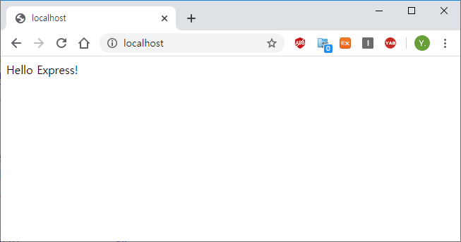
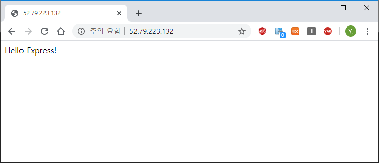

### Build Docker Image

First you need to build a `docker` image.
Run the following command in the project root.

```shell
docker build --tag hello-express ./
```

If it was built successfully, you can find the image with the following command.

```shell
docker images

REPOSITORY          TAG                 IMAGE ID            CREATED             SIZE
hello-express       latest              b783b88bb9df        6 seconds ago       973MB
node                12                  9dd56f7e705f        9 days ago          916MB
```

Let's run the image and test it.

```
docker run -p 80:80 hello-express

Example app listening at http://localhost:80
```



---

### Push to ECR

Then, you need to push the image to the repository.
This time, we will push it to the `ECR` repository.

**1. Create Repository**

```shell
aws ecr create-repository --repository-name hello-express-image

"repository": {
        "repositoryUri": "702902445118.dkr.ecr.ap-northeast-2.amazonaws.com/hello-express-image",
        ...
    }
}
```

**2. Tag Image**

```shell
docker tag \
    hello-express:latest \
    702902445118.dkr.ecr.ap-northeast-2.amazonaws.com/hello-express-image # your repositoryUri
```

**3. Push Image**

```shell
docker push 702902445118.dkr.ecr.ap-northeast-2.amazonaws.com/hello-express-image
```

---

### Create EC2-Cluster Using ECS

The tasks below require [`ecs-cli`](https://docs.aws.amazon.com/AmazonECS/latest/developerguide/ECS_CLI.html).

**1. Configure `cluster`, `profile`**

```shell
# configure cluster
ecs-cli configure \
    --default-launch-type EC2 \
    --cluster hello-express-cluster \
    --config-name hello-express-config \
    --region ap-northeast-2


# configure profile
ecs-cli configure profile \
    --access-key __YOUR_ACCESS_KEY__ \
    --secret-key __YOUR_SECRET_KEY__ \
    --profile-name profile
```

**2. Create `cluster`**

We will use two `t2.micro` instances.

```shell
ecs-cli up \
    --capability-iam \
    --size 2 \
    --instance-type t2.micro \
    --cluster-config hello-express-config \
    --ecs-profile profile
```

---

### Upload Compose Files to Cluster

**1. Create `docker-compose.yml`**

```yml
version: "3"
services:
  web:
    image: 702902445118.dkr.ecr.ap-northeast-2.amazonaws.com/hello-express-image
    ports:
      - "80:80"
    logging:
      driver: awslogs
      options:
        awslogs-group: hello-express-cluster
        awslogs-region: ap-northeast-2
        awslogs-stream-prefix: web
```

**2. Create `ecs-params.yml`**

`compose format version 3` require `ecs-params.yml` to specify the CPU and memory.

```yml
version: 1
task_definition:
  services:
    web:
      cpu_shares: 100
      mem_limit: 512000000
```

**3. Upload `docker-compose.yml`, `ecs-params.yml` to `cluster`**

```shell
ecs-cli compose up \
    --create-log-groups \
    --cluster-config hello-express-config \
    --ecs-profile profile
```

**4. Check Status**

```shell
ecs-cli ps \
    --cluster-config hello-express-config \
    --ecs-profile profile

Name                                      State    Ports                     TaskDefinition   Health
46a98bff-5298-401d-8b49-d58413c9a0bc/web  RUNNING  52.79.223.132:80->80/tcp  hello-ecs-ec2:3  UNKNOWN
```

**5. View Your Service**



---

### Change Scale

**1. Creating Another Job**

```ts
ecs-cli compose scale 2 \
    --cluster-config hello-express-config \
    --ecs-profile profile
```

**2. Check Status**

```shell
ecs-cli ps \
    --cluster-config hello-express-config \
    --ecs-profile profile

Name                                      State    Ports                     TaskDefinition   Health
46a98bff-5298-401d-8b49-d58413c9a0bc/web  RUNNING  52.79.223.132:80->80/tcp  hello-ecs-ec2:3  UNKNOWN
57fccae9-7717-4d9a-abe2-4bc46d9c978b/web  RUNNING  13.125.199.14:80->80/tcp  hello-ecs-ec2:3  UNKNOWN
```

---

### Resigter AS Service

**1. Shutdown Test Task**

```shell
ecs-cli compose down \
    --cluster-config hello-express-config \
    --ecs-profile profile
```

**2. Create Service using compose file**

```shell
ecs-cli compose service up \
    --cluster-config hello-express-config \
    --ecs-profile profile
```

---

### Clean Up

**1. Remove Service**

```shell
ecs-cli compose service rm \
    --cluster-config hello-express-config \
    --ecs-profile profile
```

**2. Remove Cluster**

```shell
ecs-cli down \
    --force \
    --cluster-config hello-express-config \
    --ecs-profile profile
```

**3. Remove Docker Repository**

```shell
aws ecr delete-repository \
    --force \
    --repository-name hello-express-image
```

---
